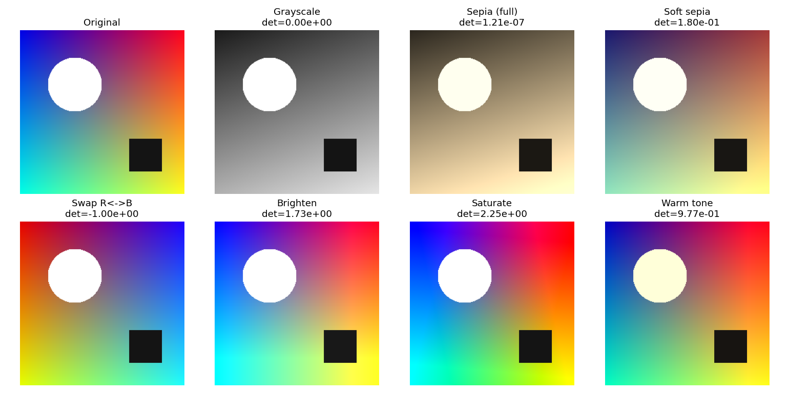
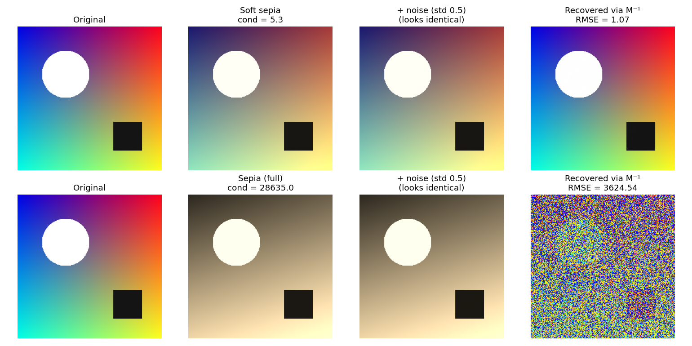

# Linear Algebra Photo Studio

Matrix multiplication, inversion and photo filters, built in Python.
Mini project for **UE25MA242A: Mathematical Foundation for AI & Data Science (MFAD 2026)**,
Experiential Learning Level 2 (Orange Problem).

**Idea:** a photo is a matrix, and every photo edit is a matrix operation. Applying a filter is a
matrix product. Undoing it is a matrix inverse, which only works safely when the matrix is
invertible *and* well-conditioned.




## What it does
| Part | Matrix idea |
|---|---|
| Colour filters (grayscale, sepia, swap, brighten, saturate, warm, custom) | 3x3 matrix times each pixel's [R, G, B] |
| Geometric transforms (rotate, scale, shear, flip, translate) | 3x3 homogeneous matrices, combined by multiplication, applied by inverse mapping |
| Convolution filters (blur, sharpen, Laplacian, emboss, Sobel) | im2col: output = P x kernel; also one big convolution matrix T |
| Inversion and recovery | M^-1 undoes M; determinant says *whether*, condition number says *how safely* |
| Deblurring lab | plain T^-1 explodes with noise; ridge (T'T + lambda I)^-1 T'y fixes it |

The core routines (`matmul`, `determinant`, Gauss-Jordan `inverse`, `condition_number`) are
written by hand in `matrix_ops.py` and checked against NumPy.

## Setup and run
```
pip install -r requirements.txt
streamlit run app.py
```
Upload your own photo in the sidebar, or use the built-in sample.

## Tests and demos
```
python tests/test_matrix_ops.py
python tests/test_app_logic.py
python demo_step2.py      # also demo_step3.py ... demo_step5.py
python benchmark.py       # our code vs NumPy: accuracy and speed
```
Demo scripts write figures into `outputs/`.

## Files
| File | Purpose |
|---|---|
| `matrix_ops.py` | hand-written multiply, determinant, inverse, condition number |
| `utils.py` | image loading/saving, applying a 3x3 colour matrix |
| `color_filters.py` | colour filter matrices |
| `geometric_transforms.py` | homogeneous transforms and warping |
| `convolution_filters.py` | kernels, im2col, convolution matrix, Sobel |
| `inversion_recovery.py` | recovery experiments, noise amplification, ridge deblur |
| `app_logic.py` / `app.py` | Streamlit app: logic layer and interface |
| `benchmark.py` | manual vs NumPy comparison |
| `tests/` | unit tests |

## Team
Add team member names and SRNs here.